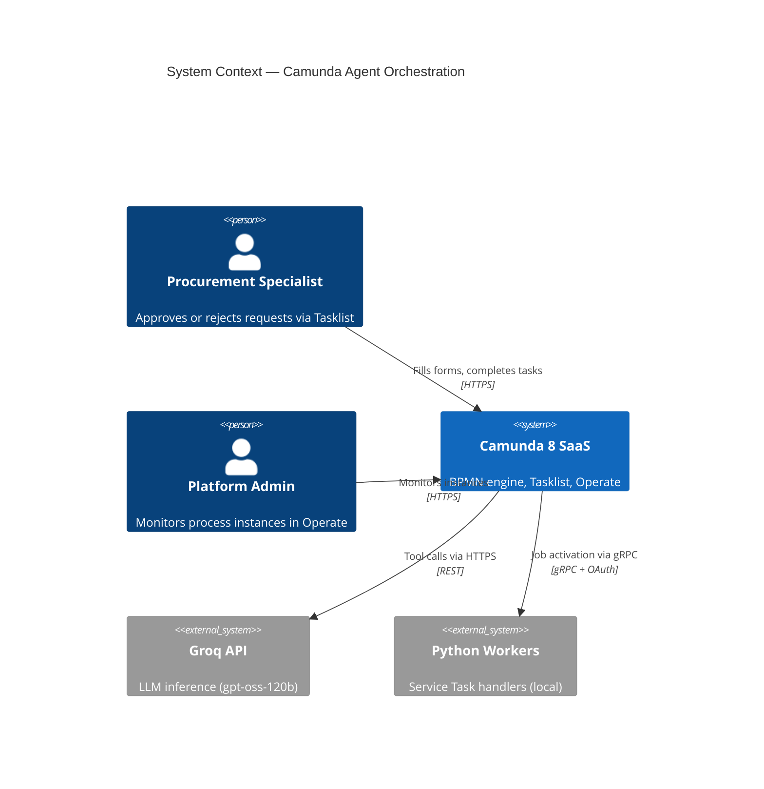
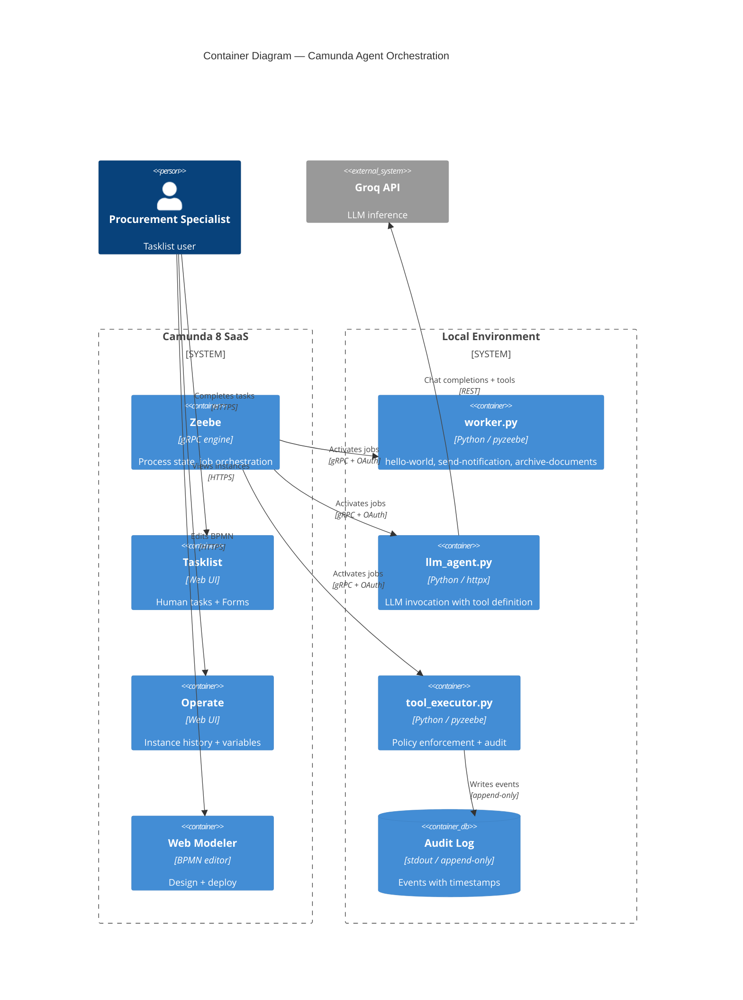
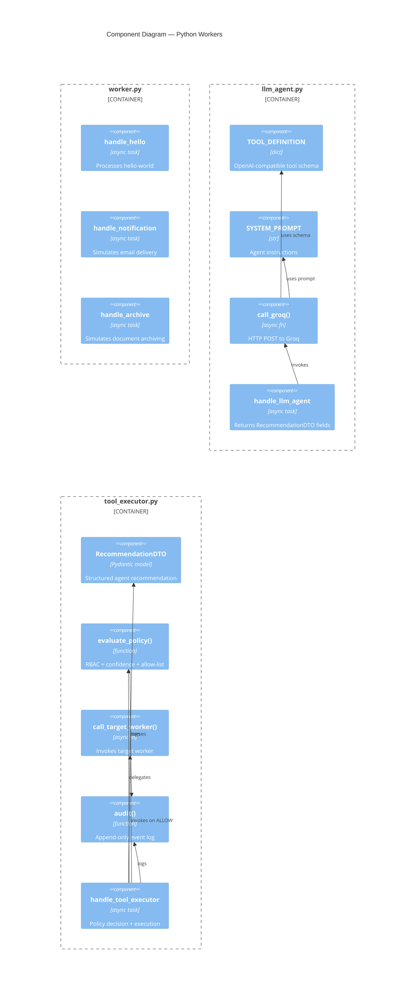

# Camunda 8 Enterprise Agent Orchestration

**Reference implementation** of the orchestration layer from [enterprise-agent-orchestration-blueprint](https://github.com/realrvs/enterprise-agent-orchestration-blueprint).

Day-by-day build of a hybrid BPMN + AI-agent orchestration system on Camunda 8 SaaS, featuring:

- Deterministic process skeleton (BPMN)
- Human-in-the-loop (Camunda Forms + Tasklist)
- Conditional and parallel routing
- LLM-driven decision making with policy enforcement
- WIMSE-compatible agent identity and append-only audit

---

## Table of Contents

1. [Architecture Overview](#architecture-overview)
2. [C4 Model Diagrams](#c4-model-diagrams)
3. [Process Walkthrough](#process-walkthrough)
4. [Repository Structure](#repository-structure)
5. [Setup](#setup)
6. [Daily Progress Log](#daily-progress-log)
7. [Alignment with Blueprint](#alignment-with-blueprint)

---

## Architecture Overview

This repository implements **Chapter 3.7 (State Management)** and **Chapter 4.1 (Agent Policies)** of the blueprint.

Key principles:

- **BPMN as deterministic skeleton** — state, timeouts, retries, human tasks.
- **LLM as probabilistic advisor** — semantics, classification, recommendations.
- **Tool Executor as Policy Enforcement Point** — RBAC, SVID, confidence thresholds.
- **Append-only audit** — every decision is logged with reasoning.

---

## C4 Model Diagrams

### Level 1 — System Context

Who uses the system and what external dependencies exist.



### Level 2 — Container

What are the major deployable units and how do they communicate.



### Level 3 — Component

What components live inside each container.



---

## Process Walkthrough

### BPMN Structure

```
Start
  │
  ▼
Service Task: hello-world          ← Python worker, returns greeting
  │
  ▼
User Task: approval-form           ← Human in the loop (Tasklist)
  │
  ▼
Parallel Gateway (split)
  │
  ├──► Service Task: send-notification
  │
  └──► Service Task: archive-documents
  │
  ▼
Parallel Gateway (join)            ← Syncs both branches
  │
  ▼
Service Task: llm-agent            ← LLM returns RecommendationDTO
  │
  ▼
Service Task: tool-executor        ← Policy enforcement
  │
  ▼
XOR Gateway
  │
  ├──► End: approved = true
  │
  └──► End: default (rejected)
```

### Variables Flow

| Variable | Set by | Used by |
|----------|--------|---------|
| `greeting` | worker.py (`hello-world`) | Display |
| `comment` | User Task (form) | `llm-agent` |
| `approved` | User Task (form) | `llm-agent`, XOR Gateway |
| `tool_name` | `llm-agent` (LLM) | `tool-executor` |
| `confidence` | `llm-agent` (LLM) | `tool-executor` (policy) |
| `reasoning` | `llm-agent` (LLM) | `tool-executor` (audit) |
| `agent_svid` | `llm-agent` (constant) | `tool-executor` (RBAC) |
| `execution_result` | `tool-executor` | Operate |

---

## Repository Structure

```
camunda/
├── README.md                  # This file
├── .env                       # Secrets (NOT committed)
├── .gitignore
├── requirements.txt
├── worker.py                  # hello-world, send-notification, archive-documents
├── llm_agent.py               # LLM invocation with tool definition
├── tool_executor.py           # Policy enforcement + audit
├── tool_contract.py           # RecommendationDTO (Pydantic)
└── bpmn/
    └── TestApp/
        ├── TestApp.bpmn       # Main process
        └── approval-form.form # Camunda Form
```

---

## Setup

### 1. Prerequisites

- Python 3.11+
- Camunda 8 SaaS account (free trial)
- Groq API key ([console.groq.com](https://console.groq.com))

### 2. Install

```powershell
python -m venv .venv
.\.venv\Scripts\Activate.ps1
pip install -r requirements.txt
```

### 3. Configure `.env`

```
ZEEBE_ADDRESS=<cluster-id>.<region>.zeebe.camunda.io:443
ZEEBE_CLIENT_ID=<client-id>
ZEEBE_CLIENT_SECRET=<client-secret>
GROQ_API_KEY=gsk_...
```

### 4. Run Workers

Three terminals, all active simultaneously:

```powershell
# Terminal 1
python worker.py

# Terminal 2
python llm_agent.py

# Terminal 3
python tool_executor.py
```

### 5. Deploy and Test

1. Open Web Modeler → `TestApp` → **Deploy & run**
2. Tasklist → Processes → `TestApp` → **Start process**
3. Fill form: comment + checkbox `approved`
4. Tasks → Assign to me → Complete Task
5. Observe in Operate: full instance should reach End without incidents

---

## Daily Progress Log

### Day 1 — Camunda 8 SaaS + Python Worker

- Registered on camunda.io, created cluster `test`
- Configured OAuth credentials (Orchestration Cluster API scope)
- Built `worker.py` with `pyzeebe`
- **Result:** process completed with `Service Task: hello-world`

**Key learning:** pyzeebe 4.x requires `async def` + `job: Job` annotation.

### Day 2 — User Task + Camunda Form

- Created `approval-form` with fields `comment` (text) and `approved` (checkbox)
- Added User Task to BPMN
- Linked form via **Link button** (🔗) — manual Form ID does not work in Camunda 8.9
- **Result:** Tasklist displays task, form saves variables to process context

**Key learning:** Camunda 8.9 requires forms to be linked via UI, not by manual ID.

### Day 3 — XOR Gateway

- Added Exclusive Gateway after User Task
- Set condition `= approved = true` for one flow
- Used default flow for the other
- **Result:** process branches based on form data

**Key learning:** FEEL conditions in Camunda start with `=` prefix.

### Day 4 — Parallel Gateway

- Added Parallel Gateway (split) after User Task
- Two Service Tasks run in parallel: `send-notification`, `archive-documents`
- Added Parallel Gateway (join) to synchronize
- **Result:** both workers process jobs simultaneously (visible in logs)

**Key learning:** `asyncio.sleep` + async workers = true parallelism.

### Day 5 — AI Agent Orchestration

- Designed `RecommendationDTO` contract (Pydantic with SVID validation)
- Built `tool_executor.py` with policy enforcement:
  - RBAC (SVID allow-list)
  - Confidence threshold (0.85)
  - Tool name allow-list
  - Append-only audit log
- Built `llm_agent.py` calling **Groq gpt-oss-120b** with tool definition
- Integrated into BPMN as two Service Tasks: `llm-agent` → `tool-executor`
- **Result:** LLM returns structured tool call, policy checks pass, execution completed

**Key learning:** Camunda 8.9 native AI Agent has FEEL/provider bugs in SaaS. **Python worker + LLM SDK is more reliable** and equally valid architecturally (blueprint §3.6.1).

---

## Audit Log Example

```json
{"event": "recommendation_received", "tool": "send-notification", "confidence": 0.95, "svid": "spiffe://test.ru/agents/procurement_agent_v1", "reasoning": "Заявка явно указана как approved=true..."}
{"event": "policy_evaluated", "allowed": true, "reason": "All policy checks passed"}
{"event": "tool_executed", "tool": "send-notification", "result": {"status": "delivered"}}
```

---

## Alignment with Blueprint

Этот репозиторий — **reference implementation** архитектурного blueprint:

**Blueprint:** [github.com/realrvs/enterprise-agent-orchestration-blueprint](https://github.com/realrvs/enterprise-agent-orchestration-blueprint)

**Что реализовано:**

| Blueprint Section | Implementation |
|-------------------|----------------|
| §3.2 A2A Protocol | `RecommendationDTO` (Pydantic) — формальный контракт агент → PEP |
| §3.3 Human-in-the-Loop | User Task с Camunda Form + Tasklist |
| §3.6.1 LLM as a Service | `llm_agent.py` — Groq gpt-oss-120b с tool calling |
| §3.7 State Management | BPMN-процесс в Camunda 8 SaaS |
| §4.1 Agent Policies | `evaluate_policy()` в `tool_executor.py` |
| §4.2 WIMSE Identity | `agent_svid` в RecommendationDTO + white-list проверка |
| §4.3 Immutable Audit | `audit()` с timestamp, job_key, reasoning |

**Как это связано с ADR:**

- **ADR-001 (Hybrid Orchestration Core):** Camunda 8 (BPMN) + Python LLM-агент + Policy Enforcement Point
- **ADR-002 (Zero-Trust Identity):** `agent_svid` с валидацией + RBAC + confidence threshold

**Что можно посмотреть в коде:**

- `worker.py` — 3 async task handlers (hello-world, send-notification, archive-documents)
- `llm_agent.py` — вызов Groq API с tool definition
- `tool_executor.py` — Policy Enforcement Point с audit log
- `tool_contract.py` — RecommendationDTO (Pydantic + SVID validation)
- `bpmn/TestApp/TestApp.bpmn` — процесс с XOR и Parallel Gateway

**Запуск и проверка:** см. раздел Setup выше.

---
